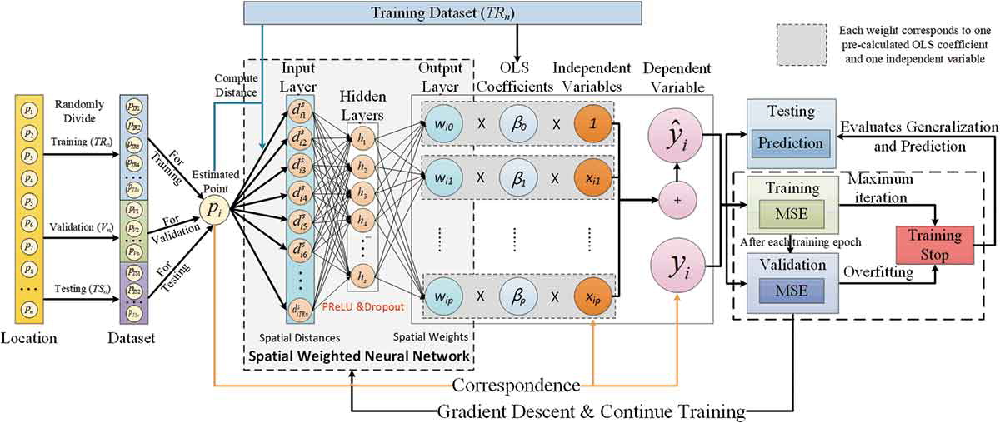
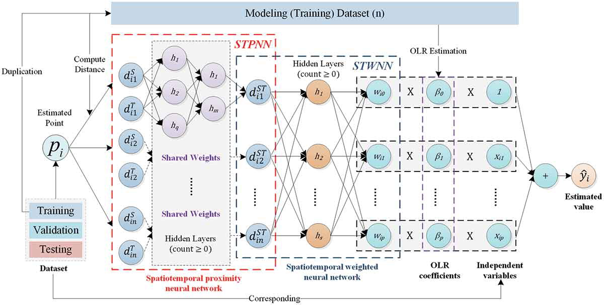
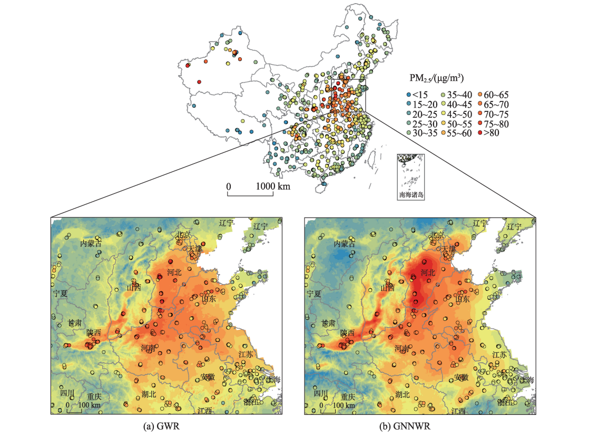
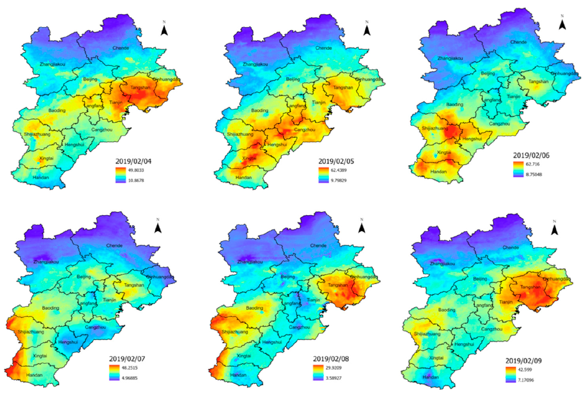
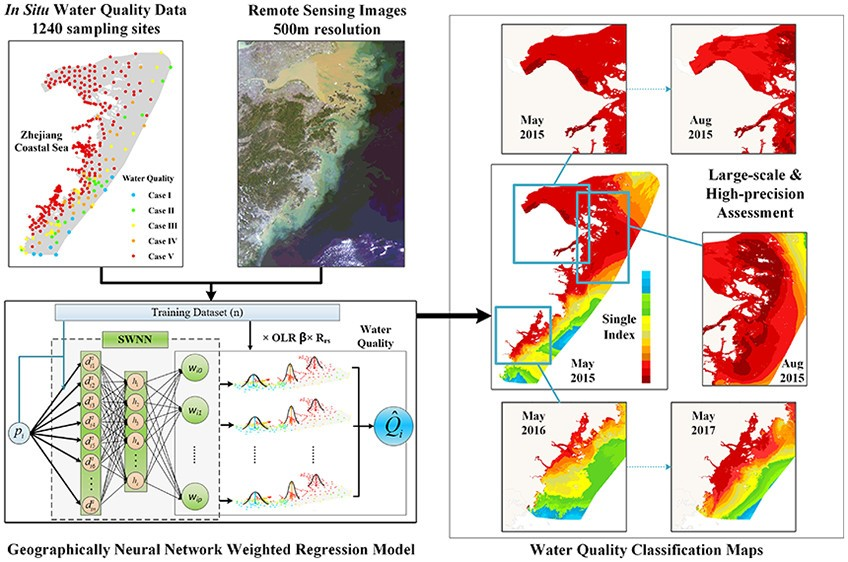
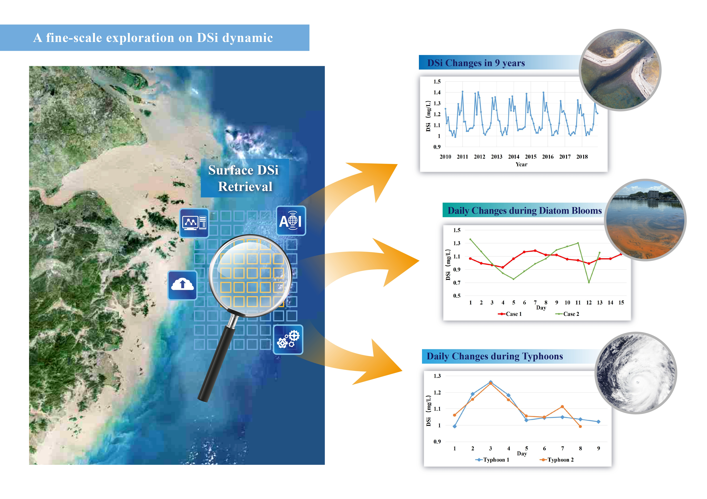
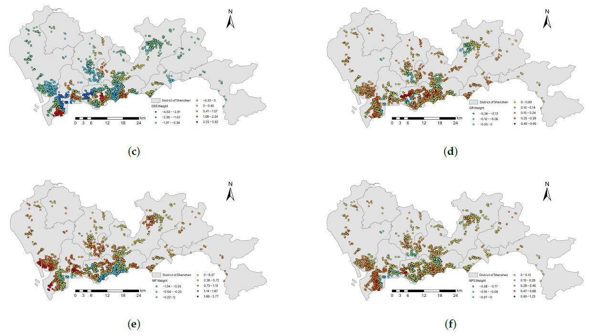
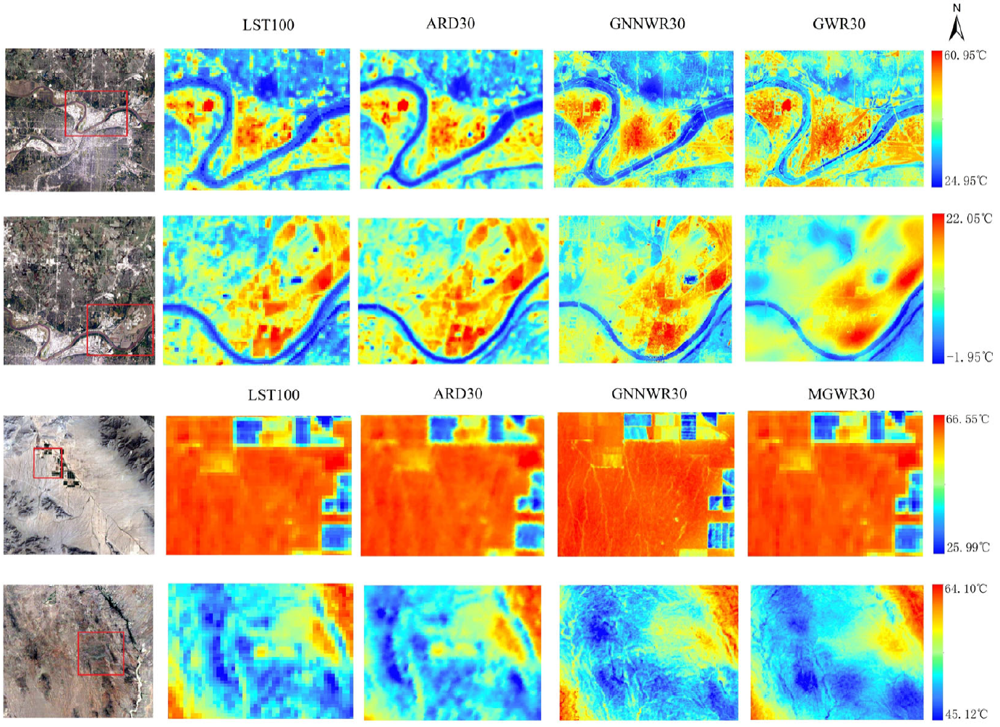

# gnnwr


[](https://pypi.org/project/gnnwr/)


A PyTorch implementation of the spatiotemporal intelligent regression (STIR) models and the repository contains:

1. Source code of GNNWR, GTNNWR model, and other derived models
2. Tutorial notebooks of how to use these model
3. Released Python wheels

## Table of Contents

- [Introduction](#1-Introduction)
- [Models](#2-Models)
- [Install & Usage](#3-Install-&-Usage)
- [Research Cases](#4-Research-Cases)
- [Reference](#5-Reference)
- [Contributing](#6-Contributing)
- [License](#7-License)

## 1 Introduction

Spatiotemporal non-stationarity is an intrinsic attribute of most geographical processes, and its estimation is a key issue in modeling spatiotemporal non-stationary relationships. To characterize spatiotemporal non-stationary relationships, we converted the expression of geographical proximity and the nonlinear fitting of non-stationary weights into the representation and construction of neural networks, and established a series of **spatiotemporal intelligent regression (STIR)** models, including geographically neural network weighted regression (**GNNWR**), and geographically and temporally neural network weighted regression (**GTNNWR**). 

The model performance is significantly better than classical spatiotemporal regression methods such as geographically weighted regression (GWR) and geographically and temporally weighted regression (GTWR), as well as machine learning methods such as neural networks and random forests. The STIR models have been applied in ecological environment modeling, atmospheric pollutant estimation, urban housing price research and other fields. These researches have been published in journals of *International Journal of Geographical Information Science*, *Environmental Science & Technology*, *Environmental Pollution*, *Science of The Total Environment*, and *International Journal of Applied Earth Observation and Geoinformation*.

## 2 Models

### 2.1 GNNWR

[GNNWR](https://doi.org/10.1080/13658816.2019.1707834) (Geographically neural network weighted regression) is a model to address spatial non-stationarity in various domains with complex geographical processes. A spatially weighted neural network (SWNN) is proposed to represent the nonstationary weight matrix and to achieve local estimation by weighted least squares with these weights. With the superior fitting ability of the neural network, GNNWR has a well-constructed nonstationary weight matrix, which makes it possible to better describe the complex geo-processes in environment and urban research.

<p align="center">

</p>

> Du, Z., Wang, Z., Wu, S., Zhang, F., & Liu, R. (2020). Geographically neural network weighted regression for the accurate estimation of spatial non-stationarity. *International Journal of Geographical Information Science*, 34(7), 1353-1377.

### 2.2 GTNNWR

[GTNNWR](https://doi.org/10.1080/13658816.2020.1775836) (Geographically and temporally neural network weighted regression), is a model for estimating spatiotemporal non-stationary relationships. Due to the existence of spatiotemporal non-stationary, the spatial relationships of features exhibit significant differences with changes in spatiotemporal structure. The calculation of spatiotemporal distance is an important aspect of solving spatiotemporal non-stationary problems. Therefore, this model introduces spatiotemporal distance into the GNNWR model and proposes a spatiotemporal proximity neural network (STPNN) to accurately calculate spatiotemporal distance. Collaborate with SWNN in the GNNWR model to calculate the spatiotemporal non-stationary weight matrix, thereby achieving accurate modeling of spatiotemporal non-stationary relationships.

<p align="center">

</p>

> Wu, S., Wang, Z., Du, Z., Huang, B., Zhang, F., & Liu, R. (2021). Geographically and temporally neural network weighted regression for modeling spatiotemporal non-stationary relationships. *International Journal of Geographical Information Science* , 35(3), 582-608.

## 3 Install & Usage

### 3.1 Install

**⚠ If you want to run gnnwr with your GPU, make sure you have installed *pytorch with CUDA support* beforehead:**

For example, a torch 1.13.1 with cuda 11.7:

``` bash
> pip list | grep torch
torch                   1.13.1+cu117
```

You can find install support on [Pytorch's official website](https://pytorch.org/)  for installing the right version that suits your environment.

**⚠ If you only want to run gnnwr with your CPU, or you have already installed the correct version of pytorch:**

Using pip to install gnnwr:  

```
pip install gnnwr
```

### 3.2 Usage

We provide a series of encapsulated methods and predefined default parameters, users only need to use to load dataset with `pandas` , and call the functions in `gnnwr` package to complete the regression:

```python
from gnnwr import models,datasets
import pandas as pd

data = pd.read_csv('your_data.csv')

train_dataset, val_dataset, test_dataset = datasets.init_dataset(data=data,
                                                                 test_ratio=0.2, valid_ratio=0.1,
                                                                 x_column=['x1', 'x2'], y_column=['y'],
                                                                 spatial_column=['u', 'v'])

gnnwr = models.GNNWR(train_dataset, val_dataset, test_dataset)

gnnwr.run(100)
```

For other uses of customization, the [demos](https://github.com/zjuwss/gnnwr/tree/main/demo) can be referred to.

## 4 Research Cases

### 4.1 Atmospheric Environment

#### 4.1.1 Air pollution of PM2.5

Air pollution, especially the measurement of PM2.5, has recently been a popular research topic in China. Using the data of PM2.5 which is collected by separated stations and considering the complicated terrain variability and wide geographical scope in China, the work of estimating and mapping the PM2.5 distributions across China with high accuracy and reasonable details is challenged by significant spatial nonstationary and complex nonlinearity. GNNWR model can obtain spatially continuous PM2.5 estimates in China with the processed data of AOD, DEM, as well as some climate factors. The estimation of PM2.5 is closer to the ground observation than the results of the traditional regression model, and it is more accurate in the high-value zone and more detailed.

<p align="center">

</p>

> Chen, Y., Wu, S., Wang, Y., Zhang, F., Liu, R., & Du, Z. (2021). Satellite-based mapping of high-resolution ground-level pm2. 5 with VIIRS IP AOD in China through spatially neural network weighted regression. *Remote Sensing*, *13*(10), 1979.

👉 [Modeling PM2.5 with GNNWR on Deep-time.org](https://mydde.deep-time.org/org-portal/MyDDE/project/65519461afe0567cf0d50519)

#### 4.1.2 Air pollution of NO2

This study utilized TROPOMI remote sensing data, ground observation data, and other ancillary data to construct a high-resolution spatiotemporal distribution and evaluation of ground-level NO2 concentrations in the Beijing–Tianjin–Hebei region using the GTNNWR model. The results demonstrated that the GTNNWR model outperformed the Random Forest (RF), and Convolutional Neural Network (CNN) models in performance metrics, showcasing greater reliability when considering spatiotemporal non-stationarity. This study provides crucial data support and reference for atmospheric environmental management and pollution prevention and control in the Beijing–Tianjin– Hebei region.

<p align="center">

</p>

> Liu, C., Wu, S., Dai, Z., Wang, Y., Du, Z., Liu, X., & Qiu, C. (2023). High-Resolution Daily Spatiotemporal Distribution and Evaluation of Ground-Level Nitrogen Dioxide Concentration in the Beijing–Tianjin–Hebei Region Based on TROPOMI Data. *Remote Sensing*, *15*(15), 3878.

### 4.2 Coastal and Oceanic Environment

#### 4.2.1 Water quality

The accurate assessment of large-scale and complex coastal waters is a grand challenge due to the spatial non-stationarity and complex nonlinearity involved in integrating remote sensing and in situ data. We developed a water quality assessment method based on a newly proposed GNNWR model to address that challenge and obtained a highly accurate and realistic water quality distribution on the basis of the comprehensive index of Chinese Water Quality Classification Standards. The GNNWR model achieved higher prediction performance (average R2 = 84%) in comparison to the widely used models, and the obtained water quality classification (WQC) maps in May of 2015–2017 and August 2015 can depict intuitively reasonable spatiotemporal patterns of water quality in the ZCS. 

<p align="center">

</p>

> Du, Z., Qi, J., Wu, S., Zhang, F., & Liu, R. (2021). A spatially weighted neural network based water quality assessment method for large-scale coastal areas. *Environmental science & technology*, *55*(4), 2553-2563.

#### 4.2.2 Coastal Environment

Transferring dissolved silicate (DSi) from land to coastal environments is vital for global biogeochemical cycling. Yet pinpointing coastal DSi distribution is complex due to spatiotemporal variability, nonlinear modeling, and low sampling resolution. GTNNWR model, by converting the spatiotemporal relationships between sparse sampling points and unknown points into space-time distances and weights, and using neural networks to determine the nonlinear distances and nonstationary weights, outperforms traditional regression models in both fitting accuracy and generalization ability. This effective data-driven-based method can help explore the fine-scale dynamic changes in coastal seas like surface DSi.

<p align="center">

</p>

> Qi, J., Du, Z., Wu, S., Chen, Y., & Wang, Y. (2023). A spatiotemporally weighted intelligent method for exploring fine-scale distributions of surface dissolved silicate in coastal seas. _Science of The Total Environment_ , 886, 163981.


👉 [Modeling DSi with GTNNWR on Deep-time.org](https://mydde.deep-time.org/org-portal/MyDDE/project/64f976f12a7491e657f02793)

### 4.3 Urban

#### 4.3.1 House price

Housing prices are closely related to the lives of new urban residents, and they also comprise a vital economic index to which the government needs to pay close attention. Compare with traditional regression models, GNNWR and GTNNWR model can improve the accuracy of real estate appraisal with the help of neural networks, which are practical and powerful ways to assess house prices.

<p align="center">

</p>

> Wang, Z., Wang, Y., Wu, S., & Du, Z. (2022). House Price Valuation Model Based on Geographically Neural Network Weighted Regression: The Case Study of Shenzhen, China. *ISPRS International Journal of Geo-Information*, *11*(8), 450.

#### 4.3.2 Land Surface Temperature

Spatial downscaling is an important approach to obtain high-resolution land surface temperature (LST) for thermal environment research. A high-resolution surface temperature downscaling method based on GNNWR was developed to effectively handle the problem of surface temperature downscaling. The results show that the proposed GNNWR model achieved superior downscaling accuracy compared to widely used methods in four test areas with large differences in topography, landforms, and seasons. The findings suggest that GNNWR is a practical method for surface temperature downscaling considering its high accuracy and model performance.

<p align="center">

</p>

> Liang, M., Zhang, L., Wu, S., Zhu, Y., Dai, Z., Wang, Y., ... & Du, Z. (2023). A High-Resolution Land Surface Temperature Downscaling Method Based on Geographically Weighted Neural Network Regression. *Remote Sensing*, *15*(7), 1740.

**!!Further, these spatiotemporal intelligent regression models can be applied to other spatiotemporal modeling problems and socioeconomic phenomena.**

## 5 Related Research Papers

### 5.1 Algorithm  

1. Du, Z., Wang, Z., Wu, S., Zhang, F., & Liu, R. (2020). Geographically neural network weighted regression for the accurate estimation of spatial non-stationarity. *International Journal of Geographical Information Science*, 34(7), 1353-1377.  
2. Wu, S., Wang, Z., Du, Z., Huang, B., Zhang, F., & Liu, R. (2021). Geographically and temporally neural network weighted regression for modeling spatiotemporal non-stationary relationships. *International Journal of Geographical Information Science* , 35(3), 582-608.
3. Dai, Z., Wu, S., Wang, Y., Zhou, H., Zhang, F., Huang, B., & Du, Z. (2022). Geographically convolutional neural network weighted regression: A method for modeling spatially non-stationary relationships based on a global spatial proximity grid. *International Journal of Geographical Information Science*, *36*(11), 2248-2269.

### 5.2 Case study demo
1. Chen, Y., Wu, S., Wang, Y., Zhang, F., Liu, R., & Du, Z. (2021). Satellite-based mapping of high-resolution ground-level pm2. 5 with VIIRS IP AOD in China through spatially neural network weighted regression. *Remote Sensing*, *13*(10), 1979.
2. Qi, J., Du, Z., Wu, S., Chen, Y., & Wang, Y. (2023). A spatiotemporally weighted intelligent method for exploring fine-scale distributions of surface dissolved silicate in coastal seas. *Science of The Total Environment* , 886, 163981.
3. Du, Z., Qi, J., Wu, S., Zhang, F., & Liu, R. (2021). A spatially weighted neural network based water quality assessment method for large-scale coastal areas. *Environmental science & technology*, *55*(4), 2553-2563.
4. Liang, M., Zhang, L., Wu, S., Zhu, Y., Dai, Z., Wang, Y., ... & Du, Z. (2023). A High-Resolution Land Surface Temperature Downscaling Method Based on Geographically Weighted Neural Network Regression. *Remote Sensing*, *15*(7), 1740.
5. Liu, C., Wu, S., Dai, Z., Wang, Y., Du, Z., Liu, X., & Qiu, C. (2023). High-Resolution Daily Spatiotemporal Distribution and Evaluation of Ground-Level Nitrogen Dioxide Concentration in the Beijing–Tianjin–Hebei Region Based on TROPOMI Data. *Remote Sensing*, *15*(15), 3878.
6. Wang, Z., Wang, Y., Wu, S., & Du, Z. (2022). House Price Valuation Model Based on Geographically Neural Network Weighted Regression: The Case Study of Shenzhen, China. *ISPRS International Journal of Geo-Information*, *11*(8), 450.
7. Wu, S., Du, Z., Wang, Y., Lin, T., Zhang, F., & Liu, R. (2020). Modeling spatially anisotropic nonstationary processes in coastal environments based on a directional geographically neural network weighted regression. *Science of the Total Environment*, *709*, 136097.


## 6 Contributing

### Contributors
- Sensen Wu, Associate Professor, Zhejiang University
- Zhenhong Du, Professor, Zhejiang University
- Jin Qi, Postdoctoral fellow, Zhejiang University
- Jiale Ding, PhD student, Zhejiang University
- Yi Liu, Undergraduate student, Zhejiang University
- Ziyu Yin, Undergraduate student, Zhejiang University

<a href="https://github.com/zjuwss/gnnwr/graphs/contributors"></a>


## 7 License
[GPLv3 license](https://github.com/zjuwss/gnnwr/blob/main/LICENSE)


